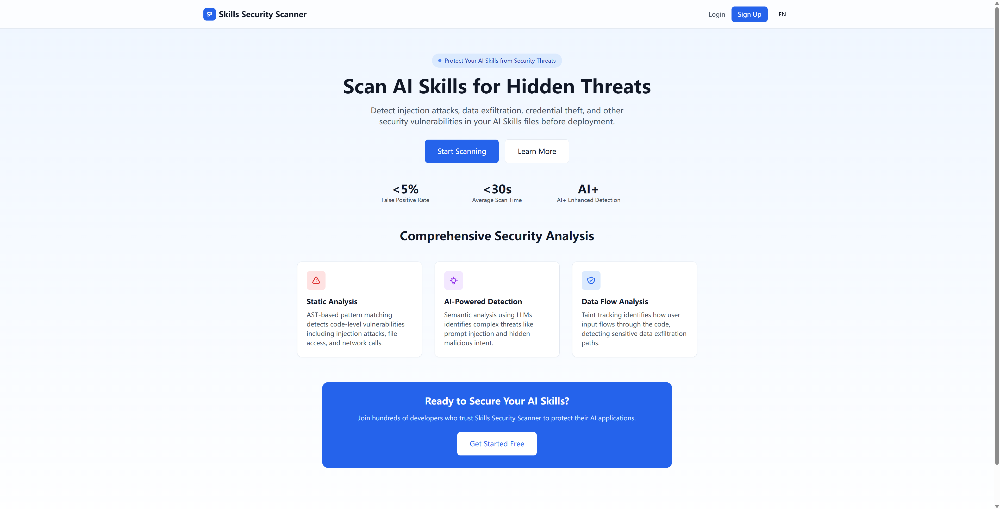
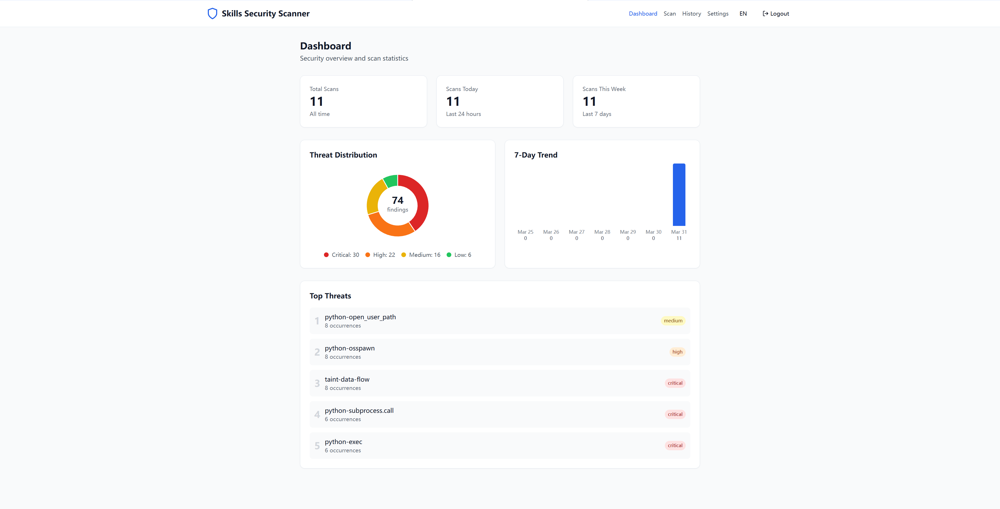
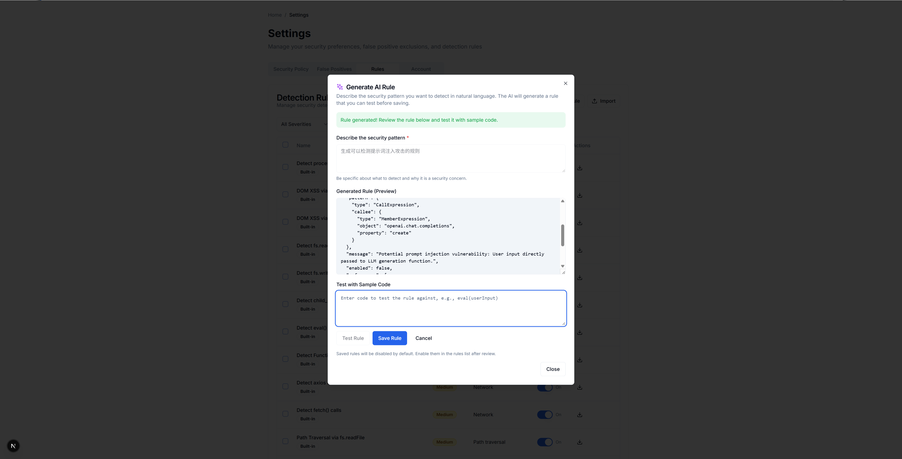
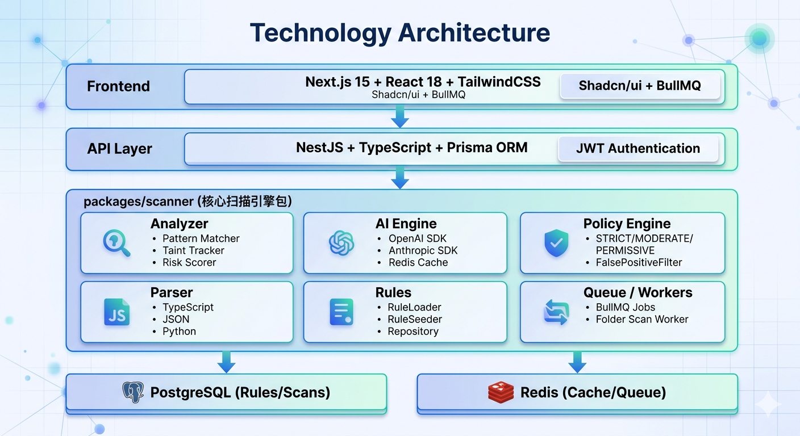

# Skills Security Scanner (S³)

<div align="center">

**Security Scanner for AI Skills**

[](https://opensource.org/licenses/MIT)
[](https://nodejs.org)
[](https://www.typescriptlang.org/)
[](https://docker.com/)

[中文版](./docs/readme_zh.md)

</div>

---

## GitHub About

> AI Skills security scanner with static analysis + AI semantic detection for prompt injection, code execution, credential leaks, and unsafe data flows.

**Suggested topics**: `ai-security`, `security-scanner`, `static-analysis`, `prompt-injection`, `typescript`, `nextjs`, `nestjs`, `monorepo`

---

## Overview

As AI Agents and openclaw become mainstream, **AI Skills** (tool plugins) are the dominant way to extend AI capabilities. However, Skills files may contain malicious code or prompt instructions that pose serious threats to user system security and data safety.

**Skills Security Scanner (S³)** is a platform dedicated to AI Skills security detection, combining static analysis, data flow tracking, and AI semantic analysis to provide multi-layered threat detection and risk assessment.



---

## Key Features

### 1. Automated Security Scanning

Upload any AI Skill file; the system automatically parses, analyzes, scores, and returns a structured security report.

Built-in **static analysis + AI semantic analysis** dual engine:
- Static analysis based on AST parsing and pattern matching, quickly identifies known threat patterns
- AI engine (configurable with OpenAI or Claude API) further understands code intent, detecting Prompt injection, zero-day vulnerabilities and other risks that static rules cannot cover

Results are intelligently deduplicated and merged, with Redis caching accelerating repeated scans.

For details on the scanning engine, see [docs/scanner-engine.md](docs/scanner-engine.md).

Supports uploading a single file or an entire folder for batch analysis.

### 2. Comprehensive Threat Detection Coverage

The system ships with **18+ built-in detection rules** covering the most common AI Skill security threats:

| Threat Type | Description |
|------------|-------------|
| Code Injection | eval / Function constructor / child process execution |
| File System Access | Arbitrary file read/write, path traversal attacks |
| Credential Leakage | API keys, sensitive credentials in env vars being exfiltrated |
| Network Requests | Unrestricted HTTP requests being sent out |
| Prototype Pollution | Property injection caused by Object.assign merge |
| Prompt Injection | Malicious instruction override, conversation hijacking |

Each detection includes precise code location (line/column), problem description, and fix suggestions.

### 3. Security Posture Visualization

Dashboard provides a real-time view of your team's AI Skill security posture:



- Total scan count and high-risk file distribution
- 7-day / 30-day threat trend
- Discovery and handling status of suspicious files

### 4. Extensible Rule System

- **Built-in rules**: Ready to use, continuously updated
- **Custom rules**: Write business-specific detection logic
- **AI-assisted generation**: Describe your requirements; AI generates the rule (requires human review before activation)



### 5. Multi-level Security Policies

Choose the appropriate detection strictness for different scenarios:

| Policy Level | Behavior |
|-------------|----------|
| **STRICT** | Block all high-risk operations; requires human confirmation to proceed |
| **MODERATE** | Log alerts, AI-assisted review; no automatic blocking |
| **PERMISSIVE** | Log only, no intervention; suitable for testing environments |

---

## Architecture



### Tech Stack

| Layer | Technology |
|-------|------------|
| Frontend | Next.js 15, React 18, TailwindCSS, Shadcn/ui |
| Backend | NestJS, TypeScript, Prisma ORM |
| Database | PostgreSQL 16, Redis 7 |
| Message Queue | BullMQ (Redis-based) |
| Rule Storage | PostgreSQL (Phase 12) + JSON files |
| AI Integration | OpenAI SDK, Anthropic SDK |
| Testing | Vitest (frontend), Jest (backend), Playwright (E2E) |
| Deployment | Docker Compose |

### Core Modules (Monorepo)

```
packages/
├── scanner/           # Core scanning engine
│   └── src/
│       ├── ai-engine/     # AI semantic analysis, caching, circuit breaker
│       ├── analyzer/      # PatternMatcher, TaintTracker, RiskScorer
│       ├── factory.ts     # Scanner instance factory
│       ├── parser/        # TypeScript, JSON, Python parsers
│       ├── policy/        # Policy enforcement, FalsePositive filtering
│       ├── queue/         # BullMQ task queue
│       ├── rules/         # Rule loading, schema validation, Seeder
│       ├── scanner.ts     # Scanner main class
│       ├── storage/       # DB/Redis clients and Repository
│       ├── types/         # TypeScript type definitions
│       └── workers/       # Background workers (scan, folder batch)
├── database/          # Prisma ORM + database client
│   └── prisma/           # Schema, Migrations
└── cli/               # Command-line scanning tool
```

---

## Quick Start

### Production (Docker Compose)

```bash
# 1. Configure environment variables in docker-compose.yml
#    - JWT_SECRET (must be identical for both api and web)
#    - DATABASE_URL
#    - REDIS_URL
#    - PGDB_password

# 2. Build and start
docker-compose up --build

# 3. Initialize database (first time only)
docker-compose exec api npx prisma db push
docker-compose exec api npx prisma db seed
```

### Development

```bash
# 1. Install dependencies
npm install

# 2. Configure environment variables
cp .env.example .env

# 3. Initialize database
npm run db:migrate
npm run db:seed

# 4. Start dev server
npm run dev
# Frontend → http://localhost:3000
# API     → http://localhost:3001
```

For detailed instructions, see [docs/how_to_use.md](docs/how_to_use.md).

---

## API Examples

### Scan a File

```bash
curl -X POST http://localhost:3001/api/scan \
  -H "Content-Type: application/json" \
  -H "Authorization: Bearer <token>" \
  -d '{
    "fileId": "unique-file-id",
    "content": "eval(userInput)",
    "filename": "skill.js"
  }'
```

### List Rules

```bash
curl http://localhost:3001/api/rules \
  -H "Authorization: Bearer <token>"
```

---

## Threat Detection Coverage

| Category | Example Threats |
|----------|----------------|
| Code Injection | `eval()`, `Function()`, `child_process.exec()` |
| File Access | `fs.writeFile()`, path traversal |
| Credential Leakage | AWS Key, Google API Key, GitHub Token |
| Network Requests | `fetch()`, `axios` unrestricted calls |
| Prototype Pollution | `Object.assign()` merge, `__proto__` injection |
| DOM XSS | `innerHTML`, `document.write()` |
| Unsafe Deserialization | `JSON.parse()` with malicious payload |

---

## Roadmap

| Phase | Description | Status |
|-------|-------------|--------|
| 1-4 | Core scanning engine + Web UI | ✅ Done |
| 5-7 | Rule engine + AI-enhanced analysis | ✅ Done |
| 8-10 | Dashboard + internationalization | ✅ Done |
| 11 | Docker Compose deployment | ✅ Done |
| **12** | **Database-backed rules** | ✅ Done |
| 13+ | Sandbox isolation, execution behavior monitoring | Planned |

---

## License

MIT License — see [LICENSE](./LICENSE)

---

**Making AI Skills Safer**
